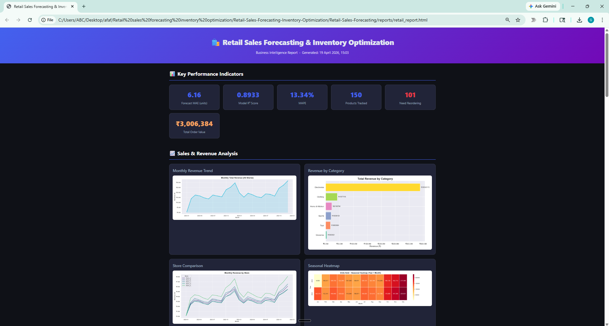

# AI-Driven Supply Chain Control Tower


**SQL Analytics · Financial Analysis · Demand Forecasting · Inventory Optimization · Supplier Risk · Decision Intelligence**

An end-to-end supply-chain analytics platform that turns retail sales and supplier operations into **business KPIs, financial insights, forecasts, inventory decisions, risk signals, and prioritized actions**.

> **Portfolio disclosure:** The dataset is synthetic. Financial outputs use explicit planning assumptions, and disruption detection is decision-support analysis rather than calibrated probability or proven real-world ground truth.

## 🎯 What I Built

This project demonstrates a complete analytics-to-decision workflow relevant to **Data Analyst, Business Analyst, Finance Analyst, and Data Science** roles:

```text
Retail & Supplier Data
        ↓
SQL Business Analysis
        ↓
Financial KPIs & Variance Analysis
        ↓
Demand Forecasting
        ↓
Inventory Optimization
        ↓
Supplier & Disruption Risk
        ↓
Business Impact
        ↓
Interactive Streamlit Control Tower
```

## 📊 Key Results

Results from the current reproducible pipeline run:

| Metric | Result |
|---|---:|
| Store × SKU combinations | **150** |
| Daily records | **109,650** |
| XGBoost MAE | **5.79** |
| Seasonal-naive MAE | **8.93** |
| Forecast MAE improvement | **35.1%** |
| Current stockout pairs | **44 / 150** |
| Low-coverage pairs (<7 days) | **93 / 150** |
| Historical lost-sales exposure | **₹6.21 Cr** |
| Current inventory value | **₹29.4 Lakh** |
| Recommended replenishment | **117,294 units** |

Financial values are derived from the synthetic dataset and documented assumptions; they are **not real company results**.

## 🖥️ Dashboard

The Streamlit dashboard provides an executive view of operational and financial decisions.



### Dashboard views

- 🚨 **Control Tower** — prioritized inventory actions and filters
- 💰 **Financial Analytics** — revenue, COGS, gross margin, budget variance, DIO and holding cost
- 📈 **Sales & Revenue** — promotion effectiveness and ABC product analysis
- 📦 **Inventory** — stockouts, inventory value, coverage and replenishment signals
- 🏭 **Supplier Risk** — supplier service performance and financial exposure
- ⚠️ **Disruption** — anomaly and temporal disruption intelligence
- 🔮 **Forecast** — 30-day SKU/store demand forecasts
- 📊 **Model Benchmark** — baseline versus XGBoost performance
- 🎯 **Recommendations** — prioritized business actions

## 🧩 Core Analytics

### 1. SQL Business Analytics

PostgreSQL analysis demonstrates practical analyst SQL:

- Multi-table `JOIN`s
- `GROUP BY` and aggregations
- `CASE WHEN` business rules
- CTEs
- Window functions
- `LAG` and period-over-period analysis
- `RANK` / `PARTITION BY`
- Revenue, demand, stockout and lost-sales KPIs
- Product, store and supplier performance

Files:

- `sql/01_business_analysis.sql`
- `sql/02_finance_analysis.sql`

### 2. Financial Analysis

A dedicated finance layer connects operational performance to commercial metrics:

- Revenue
- COGS
- Gross Profit
- Gross Margin %
- Budget vs Actual
- Revenue / COGS / Gross Profit variance
- Margin variance
- Inventory Turnover
- Days Inventory Outstanding (DIO)
- Annual inventory holding cost
- Historical lost-sales exposure
- Promotion effectiveness
- ABC product classification
- Supplier-level stockout financial impact

**Cost assumption:** unit cost is modeled as **60% of list price** because procurement cost is not available in the original synthetic dataset.

**Budget assumption:** monthly budget is modeled from prior-month actual performance using explicit growth assumptions; it is not a historical company budget.

### 3. Demand Forecasting

- Store × SKU daily demand aggregation
- Leakage-safe lag and rolling features
- 1-day naive baseline
- 7-day seasonal-naive baseline
- XGBoost forecasting
- Chronological train/test evaluation
- 30-day recursive forecasting
- MAE, RMSE and MAPE comparison
- SHAP feature importance

Current run: XGBoost achieved **5.79 MAE** versus **8.93 MAE** for the seasonal-naive baseline across 150 SKU-store pairs.

### 4. Inventory Optimization

Forecast demand is translated into operational decisions:

```text
Forecast Demand
      ↓
Lead-Time Demand
      ↓
Safety Stock
      ↓
Reorder Point
      ↓
EOQ
      ↓
Recommended Replenishment
```

The output identifies **CRITICAL, REORDER, and NORMAL** inventory states for prioritized replenishment.

### 5. Supplier Risk

Supplier performance combines:

- Lead time
- On-time delivery
- Defect rate
- Delays
- Ordered vs received quantity
- Fill rate
- Composite risk scoring

### 6. Disruption Intelligence

Supplier behavior is analyzed using:

- K-Means
- Hierarchical clustering
- DBSCAN
- PCA
- Isolation Forest
- Temporal supplier × product monitoring

The temporal layer compares operational behavior against a preceding **14-day baseline**. Disruption scores are intended for prioritization, not probability estimation.

### 7. Business Impact

Operational signals are translated into business consequences:

- Current stockouts
- Historical stockout days
- Lost-sales exposure
- Inventory value
- Low inventory coverage
- Recommended replenishment
- Critical and reorder SKU-store pairs

## 🛠️ Tech Stack

**Python · Pandas · NumPy · PostgreSQL · SQL · Scikit-learn · XGBoost · SHAP · Streamlit · Matplotlib · Seaborn**

## 📁 Repository Structure

```text
.
├── app.py
├── data/
│   └── retail_sales_data.csv
├── images/
│   ├── banner.png
│   ├── Interface.png
│   ├── business/
│   ├── forecasting/
│   └── time_series/
├── sql/
│   ├── 01_business_analysis.sql
│   └── 02_finance_analysis.sql
├── src/
│   ├── generate_dataset.py
│   ├── load_to_postgres.py
│   ├── baseline_forecasting.py
│   ├── sku_level_forecasting.py
│   ├── inventory_optimization.py
│   ├── supplier_risk.py
│   ├── disruption_detection.py
│   ├── temporal_disruption.py
│   ├── create_control_tower.py
│   ├── business_impact.py
│   ├── finance_analysis.py
│   ├── shap_explainability.py
│   ├── validate_outputs.py
│   └── run_pipeline.py
├── .gitignore
├── requirements.txt
└── README.md
```

Generated pipeline CSVs are ignored by Git; the source retail dataset is retained in `data/`.

## 🚀 Quick Start

### 1. Clone the repository

```bash
git clone https://github.com/Atul1127/AI-Driven-Supply-Chain-Control-Tower.git
cd AI-Driven-Supply-Chain-Control-Tower
```

### 2. Create and activate a virtual environment

```bash
python -m venv .venv
```

**Windows Git Bash:**

```bash
source .venv/Scripts/activate
```

### 3. Install dependencies

```bash
pip install -r requirements.txt
```

### 4. Run the complete analytics pipeline

```bash
python src/run_pipeline.py
```

### 5. Launch the dashboard

```bash
streamlit run app.py
```

The pipeline generates the analytical CSV outputs consumed by the dashboard. PostgreSQL is required for the database-loading/SQL workflow; the dashboard reads the generated CSV outputs.

## 🔄 Reproducible Pipeline

```text
1. baseline_forecasting.py
2. sku_level_forecasting.py
3. inventory_optimization.py
4. supplier_risk.py
5. temporal_disruption.py
6. disruption_detection.py
7. create_control_tower.py
8. business_impact.py
9. finance_analysis.py
10. shap_explainability.py
11. validate_outputs.py
```

The final validation checks required artifacts, forecasting performance, 150-pair coverage, finance KPI consistency, ABC classifications, business-impact values, and disruption score ranges.

## 🗃️ Data

The included dataset is synthetic retail supply-chain data representing:

- **5 stores**
- **30 products**
- **8 suppliers**
- **2023–2024** dates
- **109,650 daily records**

The data supports pricing, discounts, promotions, demand, sales, revenue, inventory, stockouts, supplier performance and replenishment analysis.

## ⚠️ Evaluation & Limitations

- Forecasting is evaluated chronologically using MAE, RMSE and MAPE.
- Disruption detection is unsupervised because there is no verified historical disruption ground truth.
- Unit cost uses the documented **60%-of-list-price** assumption.
- Budget values are modeled planning assumptions rather than historical company budgets.
- Inventory formulas are simplified for portfolio demonstration.
- Historical lost-sales exposure is simulated; it should not be presented as realized savings.
- The project does not claim production deployment, streaming infrastructure, automated retraining, or real-world disruption prediction.

## 💼 Resume-Ready Description

> Built an end-to-end supply-chain analytics platform combining PostgreSQL SQL analysis, financial KPIs, variance analysis, XGBoost demand forecasting, inventory optimization, supplier risk, disruption intelligence, and an interactive Streamlit decision dashboard.

## 📌 Project Focus

**Primary roles:** Data Analyst · Business Analyst · Finance Analyst · Data Scientist

The project intentionally emphasizes the full path from **data → KPI → analysis → forecast → financial impact → business decision**, rather than adding unnecessary model complexity.
